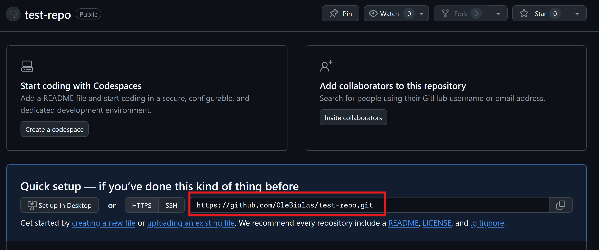
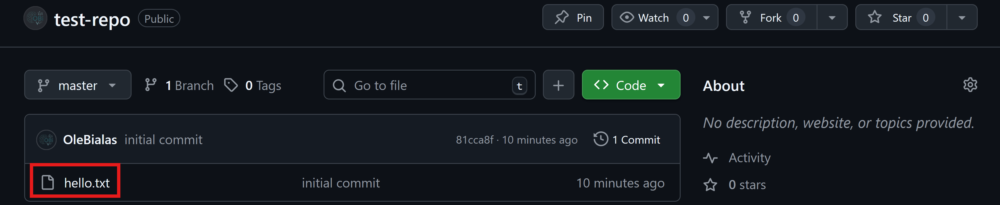
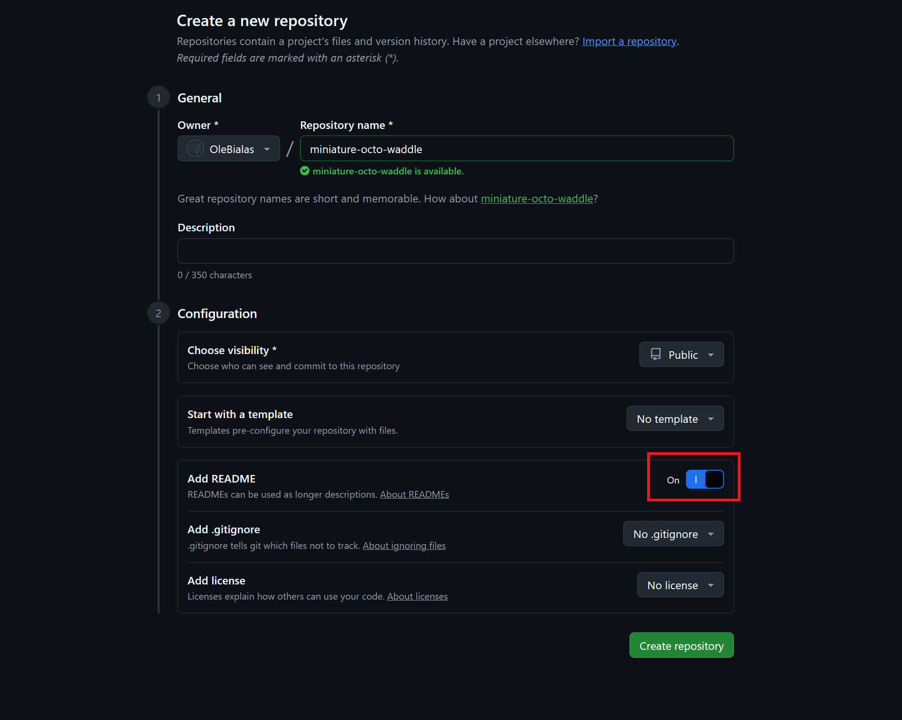
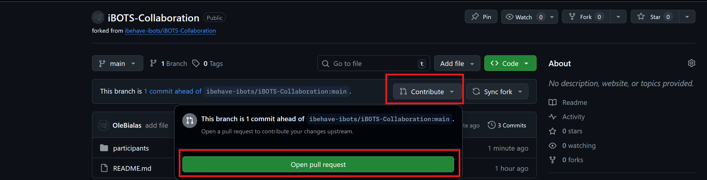

# Collaboration with GitHub

Git provides the tools to collaboratively work on a single codebase, collaboration also requires infrastructure for sharing and publishing code.
GitHub, which is owned by Microsoft, is the dominant platform for code hosting and collaboration with over 100 million developers and 400 million repositories worldwide.
While GitHub is the most popular choice, there are alternatives that provide a similar service such as [GitLab](https://about.gitlab.com/) or the community-centered nonprofit [Codeberg](https://codeberg.org/).

In this lesson, you will learn how to connect a local Git repository to GitHub, clone an existing repository to work locally, and fork repositories to contribute to open-source projects or collaborate with others. If you don't have a GitHub account yet you can [sign up for free](https://github.com/signup), fill in the required details and verify your email and complete the account setup.


## Pushing a Local Repository to GitHub

### Background

To push your local repository to GitHub, you can create a new empty repository on GitHub and add it as a remote. A remote is simply a URL that points to an online repository that Git can track. We can give the remote any name but typically it is called `origin` because it is the "source of truth" that reflects the current state of the project where others copy from. To push to the registered remote we have to set it as upstream to mark it as a target to push to. Setting the upstream requires two inputs the remote repository (i.e. `origin`) and the branch we want to push. If you haven't created any branches there is only a single one and it is called either `main` (newer name) or `master` (older name).
Once the upstream is registered we can use `git push` to push local changes to the remote repository. You can also register the upstream and push in a single command

### Exercises

In the following exercises you are going to create a new repository on GitHub, add it as a remote to you local repository and push it to the remote. You can use any existing Git repository on your machine or create one from scratch (you'll need at least one file so there is something to push). Here are the command you'll need to know:

| Code                          | Description                                                        | VS Code GUI                                                                |
|-------------------------------|--------------------------------------------------------------------|----------------------------------------------------------------------------|
| `git remote add origin <URL>` | Link the local repository to a remote GitHub repository            | Click **Source Control (Ctrl + Shift + G)** → Click **Publish Repository** |
| `git push -u origin main`     | Push local commits to the remote repository and set upstream       | Click **Source Control** → Click **...** → Click **Push**                  |
| `git push`                    | Push local commits to the remote repository (once upstream is set) | Click **Source Control** → Click **...** → Click **Push**                  |


**Exercise**: Move to an existing local Git repository or create one.

**Solution**:

```python
# in a new empty folder:
git init
# create a new file
git add .
git commit -m "Initial commit"
```

```
/tmp/new_repo
Initialized empty Git repository in /tmp/new_repo/.git/
[master (root-commit) a381100] initial commit
 1 file changed, 1 insertion(+)
 create mode 100644 hello.txt

```


**Exercise**: Create a new **public** repository on GitHub (**without** initializing it with README. It should be **completely** empty) and copy the clone URL. 


**Solution**:





**Exercise**: In your local repository, add the remote URL using `git remote add origin <repo-url>`.

**Solution**:

```python
git remote add origin https://github.com/OleBialas/test-repo.git
```


**Exercise**: Push the local repository to GitHub using `git push -u origin main` or `git push -u origin master`. When you are prompted for your credentials, put in you GitHub username and an **access token** as your password. 

To generate this token, go to your GitHub user settings


select "Developer Settings"


and "Generate new token (classic)"


give the token full access rights for everything in the "repo" category anc click create.


Then, paste the token when prompted for your GitHub password.

**Solution**:

```python
git push -u origin main # or master
```

```

Username for 'https://github.com': OleBialas
Password for 'https://OleBialas@github.com':
Enumerating objects: 3, done.
Counting objects: 100% (3/3), done.
Writing objects: 100% (3/3), 218 bytes | 218.00 KiB/s, done.
Total 3 (delta 0), reused 0 (delta 0), pack-reused 0
To https://github.com/OleBialas/test-repo.git
 * [new branch]      master -> master
branch 'master' set up to track 'origin/master'.


```


**Exercise**: Verify that the repository's content is now visible on GitHub.  

**Solution**:




**Exercise**: Add a new text file with some content and commit the changes to the repository. Then, `git push` the changes to the remote and check the GitHub repository in the browser to verify the file was transferred.

**Solution**:

```python
# after adding a new file:
git add .
git commit -m "add new file"
git push
```

```

[master f21b091] add new file
 1 file changed, 1 insertion(+)
 create mode 100644 hello2.txt
Enumerating objects: 4, done.
Counting objects: 100% (4/4), done.
Delta compression using up to 20 threads
Compressing objects: 100% (2/2), done.
Writing objects: 100% (3/3), 275 bytes | 275.00 KiB/s, done.
Total 3 (delta 0), reused 0 (delta 0), pack-reused 0
To https://github.com/OleBialas/test-repo.git
   81cca8f..f21b091  master -> master


```


**Exercise**: Add a new line to the file, commit the changes and `git push` to the remote again. hen, check the GitHub repository in the browser to verify the file was transferred.

**Solution**:

```python
# after adding a line:
git commit -am "add line"
git push
```

```

[master 35d40d7] add line
 1 file changed, 1 insertion(+)
Enumerating objects: 5, done.
Counting objects: 100% (5/5), done.
Delta compression using up to 20 threads
Compressing objects: 100% (2/2), done.
Writing objects: 100% (3/3), 276 bytes | 276.00 KiB/s, done.
Total 3 (delta 0), reused 0 (delta 0), pack-reused 0
To https://github.com/OleBialas/test-repo.git
   f21b091..5c98649  master -> master 
    

```


## Cloning a GitHub Repository to a Local Machine  

### Background

A repository on GitHub can be cloned which means that all of its content, including the full commit history, will be cloned to your local machine. Because the repository will be automatically aware of it's origin, you can `git pull` to receive updates. Note that you can clone and pull from any public repository from GitHub but you can only `git push` if you own the repository.

### Exercises

In the follwing exercises, you are going to clone repositories from GitHub and use `git pull` to receive updates after the repository changes. Here are the commands you need to know:

| Code                   | Description                                  | VS Code GUI                                                              |
|------------------------|----------------------------------------------|--------------------------------------------------------------------------|
| `git clone <repo-url>` | Clone a GitHub repository to a local machine | Click **Source Control (Ctrl + Shift + G)** → Click **Clone Repository** |
| `git pull`             | Pull the latest changes from GitHub          | Click **Source Control** → Click **...** → Click **Pull**                |
| `git pull origin main` | Pull and explicitly list the branches        | Click **Source Control** → Click **...** → Click **Pull**                |


**Exercise**: In VSCode open a new window that is NOT a git repository and clone the repository from this URL: https://github.com/ibehave-ibots/iBOTS-Collaboration.git

**Solution**:

```python
git clone
```

```

Cloning into 'iBOTS-Collaboration'...
remote: Enumerating objects: 6, done.
remote: Counting objects: 100% (6/6), done.
remote: Compressing objects: 100% (3/3), done.
remote: Total 6 (delta 0), reused 0 (delta 0), pack-reused 0 (from 0)
Receiving objects: 100% (6/6), done.


```


**Exercise**: Open the cloned folder in VSCode and inspect its contents.

**Solution**:

The folder should look like this:


**Exercise**: Create a **new public repository on GitHub**, **this time initializing it with a README** and note the URL.



**Solution**:

In the example above, the URL would be https://github.com/OleBialas/miniature-octo-waddle.git


**Exercise**: Clone the new repository, then open the cloned folder in VS Code and check that the README file exists.  

**Solution**:

```python
git clone https://github.com/OleBialas/miniature-octo-waddle.git
```

```

Cloning into 'miniature-octo-waddle'...
remote: Enumerating objects: 3, done.
remote: Counting objects: 100% (3/3), done.
remote: Total 3 (delta 0), reused 0 (delta 0), pack-reused 0 (from 0)
Receiving objects: 100% (3/3), done.


```


**Exercise**: Make a change directly on GitHub (edit the README file and commit).


**Solution**:

The change (e.g. "Hello there") should be visible in the README right away:


**Exercise**: Pull from origin and inspect the folder in VSCode to verify the changes were copied.

**Solution**:

```python
git pull
```

<pre class="ansi-output">
remote: Enumerating objects: 5, done.
remote: Counting objects: 100% (5/5), done.
remote: Total 3 (delta 0), reused 0 (delta 0), pack-reused 0 (from 0)
Unpacking objects: 100% (3/3), 931 bytes | 931.00 KiB/s, done.
From https://github.com/OleBialas/miniature-octo-waddle
   a39c4b2..519f573  main       -&gt; origin/main
Updating a39c4b2..519f573
Fast-forward
README.md | 4 <span style="color: #00aa00">+++</span><span style="color: #aa0000">-</span>
 1 file changed, 3 insertions(+), 1 deletion(-)

</pre>


## Forking and Creating Merge Requests

### Background

Instead of cloning a repository you can also fork it. A fork is a copy of the original repository on GitHub that you own and can make changes to.
After you made changes (e.g. adding a new feature or fixing a bug), you can als ask the owner of the original repository to incorporate your changes.
This is called a pull request or merge request and it is the standard mechanism for contributing to open-source projects.
The owner of the original repository can review the merge request, comment on it and reject or accept it.

### Exercises

In the following exercises you will fork a repository, modify your fork and then create a merge request for the original repository. Here are the commands you need to know:

| Code                                          | Description                                                 | VS Code GUI                                                              |
|-----------------------------------------------|-------------------------------------------------------------|--------------------------------------------------------------------------|
| **(GitHub UI)**                               | Fork a repository on GitHub                                 | Click **Fork** on the GitHub repository page                             |
| `git clone <your-fork-url>`                   | Clone your forked repository locally                        | Click **Source Control (Ctrl + Shift + G)** → Click **Clone Repository** |
| `git remote add upstream <original-repo-url>` | Link the original repository as an upstream remote          | NA                                                                       |
| `git push origin main`                        | Push the merged changes to your forked repository on GitHub | Click **Source Control** → Click **...** → Click **Push**                |


**Exercise**: On GitHub, fork the repository from this URL: https://github.com/ibehave-ibots/iBOTS-Collaboration.git


**Solution**:

You should now see the forked repository under your own account:


**Exercise**: Clone your own fork

**Solution**:

```python
git clone https://github.com/OleBialas/iBOTS-Collaboration.git
```

```

Cloning into 'iBOTS-Collaboration'...
remote: Enumerating objects: 10, done.
remote: Counting objects: 100% (10/10), done.
remote: Compressing objects: 100% (5/5), done.
remote: Total 10 (delta 0), reused 4 (delta 0), pack-reused 0 (from 0)
Receiving objects: 100% (10/10), done.


```


**Exercise**: Add yourself to the participants/ folder by adding a text file (e.g. jim.txt) with a little message (make sure the file name is unique). Then, commit the new file.

**Solution**:

```python
# after adding file, e.g. participants/jim.txt:
git add .
git commit -m "add new collaborator"
```

```

[main e8a3d66] add new collaborator
 1 file changed, 1 insertion(+)
 create mode 100644 participants/jim.txt
 

```


**Exercise**: Push the changes to your fork

**Solution**:

```python
git push
```

```

Enumerating objects: 6, done.
Counting objects: 100% (6/6), done.
Delta compression using up to 20 threads
Compressing objects: 100% (3/3), done.
Writing objects: 100% (4/4), 365 bytes | 365.00 KiB/s, done.
Total 4 (delta 0), reused 0 (delta 0), pack-reused 0
To https://github.com/OleBialas/iBOTS-Collaboration.git
   5afcc73..e8a3d66  main -> main


```


**Exercises**: Go to GitHub to create a pull request (it may take a bit until it is merged)



**Solution**:

You should now see your pull request on the original repository:


**Bonus Exercise**: Choose a partner. You each create a new public repository with a README that contains your name. Then, you fork each others repositories, add your name to the README, commit the changes and create a pull request.
Finally, you acceot each others pull request and verify that the change was added to your original repository.